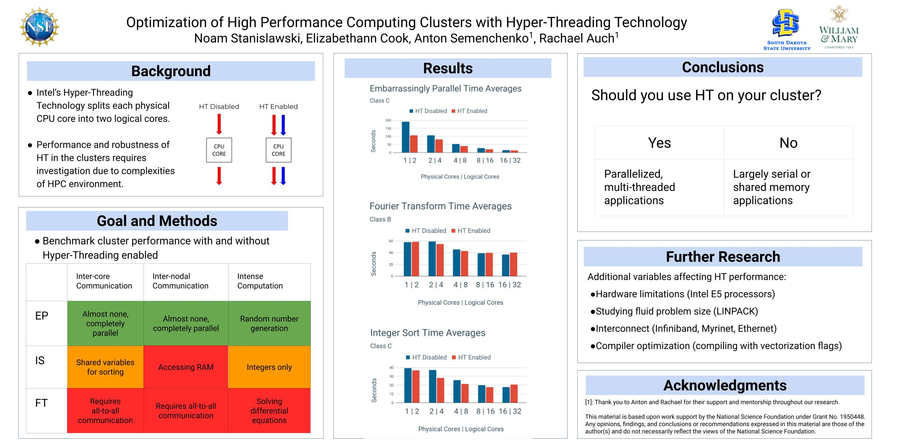

```{css style settings, echo = FALSE}
blockquote {
    padding: 10px 20px;
    margin: 0 0 20px;
    font-size: 14px;
    border-left: 5px solid #eee;
}
```

Projects
----------

**Performance Modeling for Large-Scale Linear Applications**

This is the research project I worked on during my R&D internship at Sandia National Labs in the summer of 2022. A short abstract is provided below. 

> MueLu is a software library within the Trilinos collection used for the preconditioning of large, sparse linear systems on both CPU and GPU based supercomputers. Previous work within MueLu tracks the performance of specific code, but has not been compared with optimal theoretical performance on the underlying hardware. In order to track performance relative to given hardware for MueLu’s applications, we employ performance models which take into account execution speed, memory bandwidth, and network communication cost. Implementing and evaluation these models for linear solutions enables comparisons which could be utilized as a part of Trilinos’ regular performance tracking and furthers the study of computational limitations for linear solver frameworks.

Additionally, here is a [link](https://docs.google.com/presentation/d/1rCTW-bRaSo074eFp1fwDKghN9rPBGmG11sMMXVfq1QE/edit?usp=sharing) to slides I created for presenting the work.

 
&nbsp; 
&nbsp;

**Tackling AI Bias with GANs**

This is my research project from my Fall 2021 semester of college. It was presented at the Undergraduate Cybersecurity Research Sympsoium for [COVA CCI](https://covacci.org/) that December. Here is the abstract of the [paper](https://digitalcommons.odu.edu/covacci-undergraduateresearch/2021fall/projects/10/):

> Throughout the relatively short history of artificial intelligence (AI), there has been a significant concern surrounding AI’s ability to incorporate and maintain certain characteristics which were not inherently modeled out in its coding. These behaviors stem from the prominent usage of neural network AI, which can inherit human biases from the input data it receives. This paper argues for two possible avenues to combat these biases. The first is to rethink the traditional framework for neural network projects and retool them to be usable by a Generative Adversarial Network (GAN). In a GAN’s zero-sum game, two network techniques can combat discriminatory beliefs or incorrect values in manners unlike traditional networks, while not necessitating a completely new algorithm for neural network systems already proven effective. GAN technology is one approach for helping to solve the bias issue but confronting the humans behind the AI is just as important. Incorporating humanistic techniques such as unconscious bias training and participatory design into AI development further promote equitable AI by fostering communication between others. AI biases are merely reflections of human biases in a technological form, and any “bad” output data stems from bad output humanity has generated from itself. There cannot be a perfectly unbiased AI model, as there are no perfectly unbiased humans, and the influences of economies, politics, and other vested interests ensure this to an even larger degree.

&nbsp; 
&nbsp;

**HPC Optimization Using Hyper-Threading**

My NSF REU project at [South Dakota State](https://www.sdstate.edu/mechanical-engineering/research-experience-undergraduates) from summer 2021. Read the abstract and poster below:


Poster:


> Intel’s Hyper-Threading Technology is an implementation of simultaneous multi-threading upon Intel proprietary CPU architecture. This technology allows for a single CPU core to handle two distinct processes concurrently, with the end-user and operating system recognizing the single core as two “logical processors.” Under certain conditions, this technology can improve processing speed by thirty percent. The goal of this research is to determine the potential performance boosts or degradations exist when utilizing Hyper-Threading in a high performance computing cluster environment. Hyper-Threading technology introduces a multitude of additional possible bottlenecks and runtime slow downs via the added logical cores, and isolating these issues when possible to improve performance can be crucial in large scale applications. The central hypothesis of this work is that heavily parallelized or multi-threaded applications will see increased performance from Hyper-Threading, while processes that must be run in serial will experience little to no computational benefit. The project strategy is to re-examine and retest the earlier findings of T. Leng et al. conducted at Dell in 2002 using our small-scale development high performance computing cluster. Our data collection relies on two types of software: cluster computing benchmarks and a performance analysis tool evaluating said benchmarks performance. In this case, we have used four benchmarking programs: High Performance Linpack and the EP (Embarrassingly Parallel), IS (Integer Sort), and FT (Fourier Transform) benchmarks from the NAS Parallel Benchmark suite. All of these applications are monitored by Intel’’s VTune Profiler for performance analysis, which determines statistics such as multi level cache misses, cycle per instruction retired, and total number of floating-point instructions. By utilizing these software and our cluster architecture it is determined that Hyper-Threading is a worthwhile technology for cluster computing if optimized parallel programs are being run.

